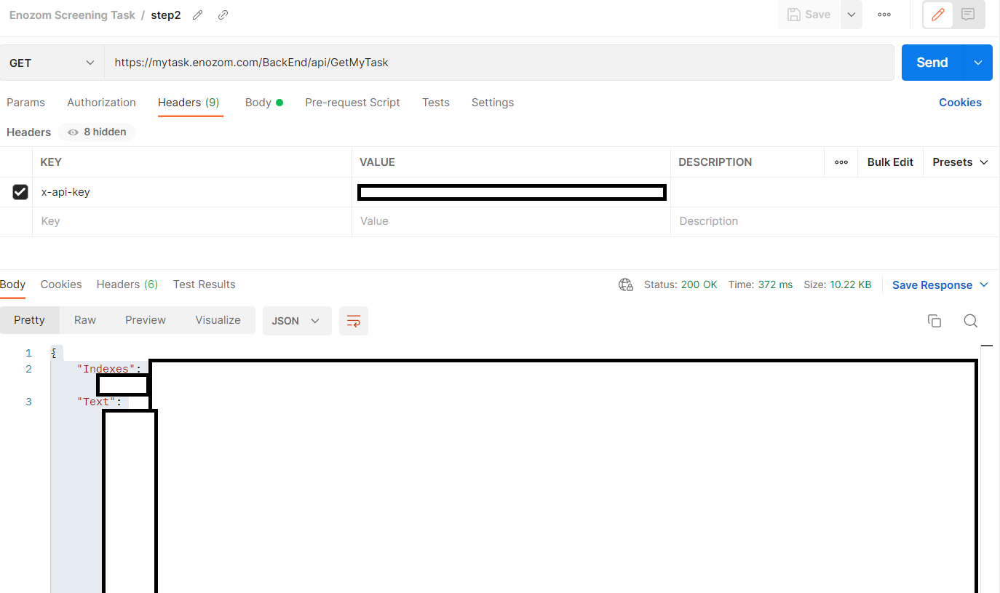

# Enozom Screening Task

- Python Code
```
pip install requests
```
```
import requests

#Step 1: Get the API key
body1 = {"Email": "mahmoud.mohamed.kamal.ismail@gmail.com"}
response1 = requests.post("https://mytask.enozom.com/BackEnd/api/GenerateAPIKey", json=body1)
API_KEY = response1.json()['ApiKey']

#Step 2: Get the data from the API
response2 = requests.get("https://mytask.enozom.com/BackEnd/api/GetMyTask", headers={"x-api-key":API_KEY})

#Step 3: Parse the data
text = response2.json()['Text']
indexes = response2.json()['Indexes'].split(",")
password = ""
for i in range(len(indexes)):
    password += text[int(indexes[i])]

#Step 4: Submit
body3 = {"Password": password}
response3 = requests.post("https://mytask.enozom.com/BackEnd/api/SubmitResult", json=body3, headers={"x-api-key":API_KEY})
print(response3.text)
```


- Postman \
Step 1: \

Step 2: \

Step 3: \


# Author
* LinkedIn - [Mahmoud Mohamed Kamal](https://www.linkedin.com/in/mahmoudfierro98)

<p align="right">(<a href="#top">Top</a>)</p>
